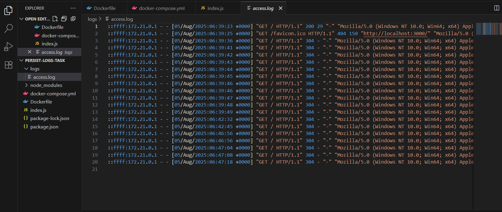

# 🚀 Task 6 – Persist App Logs Using Docker Volumes

This project demonstrates how to log HTTP requests from a Node.js application using Morgan and persist those logs on the host machine using Docker bind mounts.

---

## 📁 Project Structure

persist-logs-task/
│
├── Dockerfile # Builds the Docker image
├── docker-compose.yml # Sets up the container with volume mapping
├── index.js # Express server with logging using Morgan
├── package.json # Node.js dependencies and metadata
├── package-lock.json # Auto-generated lock file
├── .gitignore # Excludes node_modules and logs
│
└── logs/ # Host-mapped directory for log files (auto-created)
└── access.log # Request logs (generated during runtime)


---

## ✨ Key Features

- Logs every HTTP request made to the server using Morgan.
- Stores all logs persistently in a host folder using Docker bind mounts.
- Clean and minimal project structure suitable for beginners and professionals.
- Fully containerized Node.js application.

---

## 🧰 Technologies Used

- **Node.js**
- **Express.js**
- **Morgan** – HTTP request logger middleware
- **Docker**
- **Docker Compose**

---

## ⚙️ How It Works

1. The Node.js app logs incoming HTTP requests using Morgan into a file at `/usr/src/app/logs/access.log` (inside the container).
2. Docker Compose maps this path to a local `./logs/` folder on the host using a **bind mount**.
3. Logs are persisted even after stopping or removing the container.

---

## 🧪 How to Run & Test

### 1️⃣ Build and Start the App

```bash
docker-compose up --build

2️⃣ Test the App
Visit:http://localhost:3000

Each refresh or visit will log a new entry.

3️⃣ Check the Logs
On your host machine, 
view:logs/access.log
You'll see all logged requests.

4️⃣ Stop the App
Ctrl + C
To remove the container (optional):docker-compose down

📄 .gitignore
Your .gitignore includes:

node_modules/
logs/
*.log
.env

This ensures large folders and runtime files (like logs and dependencies) are not pushed to GitHub, keeping your repository clean and professional.

---

🔚 Final Result

After running the app and accessing it through the browser, logs are successfully stored in the `logs/access.log` file on the host machine.  
This confirms that Docker volumes are working correctly and logs are being persisted outside the container.


> *(Replace this image path with your actual screenshot path and name)*

---

 👨‍💻 Author

**Nikhil B**  
[GitHub](https://github.com/nikhil3939) • [LinkedIn](https://www.linkedin.com/in/nikhil-b-23b89327a)  
Trained in DevOps & Cloud Computing  
